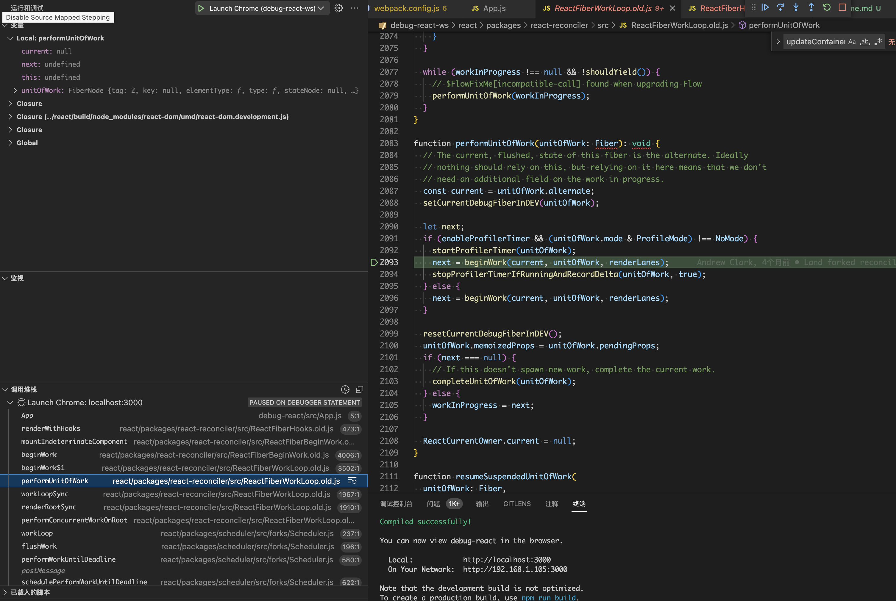
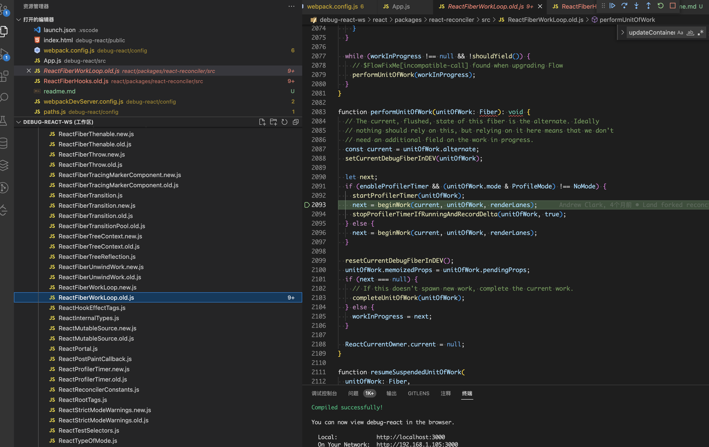

# Usage

## Clone

```bash
1. git clone https://github.com/ParadeTo/debug-react.git --depth 1
2. cd debug-react
3. git clone -b debug https://github.com/ParadeTo/react.git --depth 1
```

After that, you project will be like this:

```
debug-react
 - debug-react
 - react
```

## Build

```bash
1. cd react
2. yarn install
3. yarn build
```

## Debug

```bash
1. cd debug-react
2. yarn install
3. yarn start
```

Now, you can debug react the most original source code in vscode:



And vscode can locate you to the file if you click the `file` menu on the left side bar:


